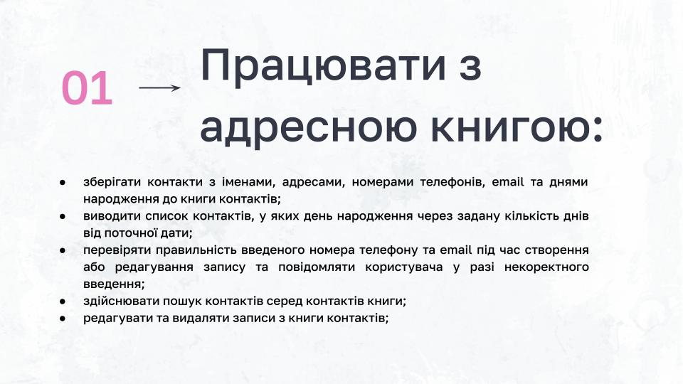
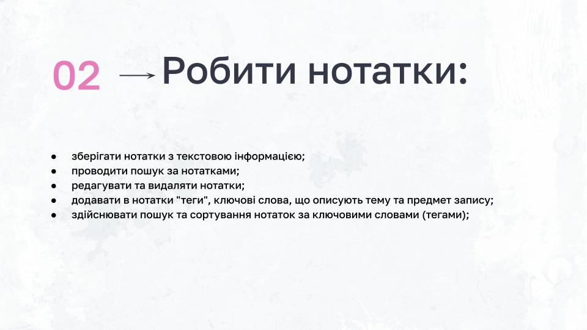

# GoIT PythonCore 13

# project "Personal Assistant"

##


## About Willy


## What can do Willy


## The First



## The Second



## The Third


## The Fourth


## The Fifth


## Developer


## Install Python-package

```
pip install -i https://test.pypi.org/simple/ Willy
```

або

```
pip3 install -i https://test.pypi.org/simple/ Willy
```

## Run Willy

в терміналі виконайте команду:

```
willy
```
