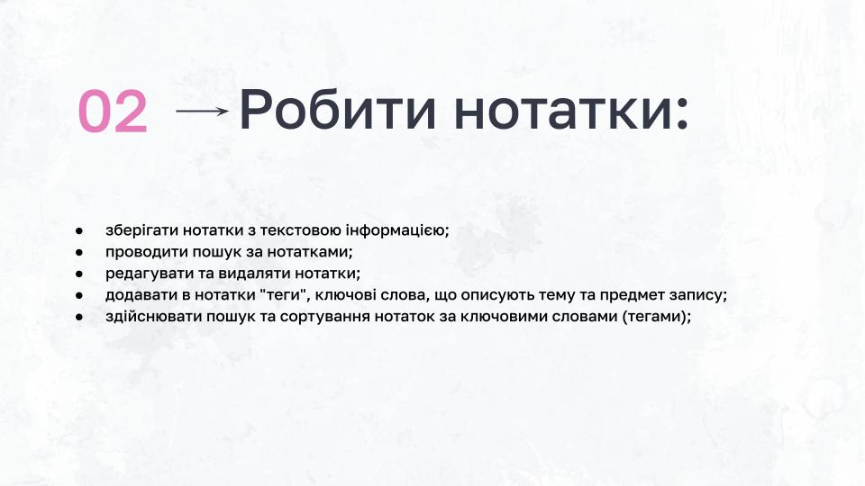

# GoIT PythonCore 13
# project "Personal Assistant"
##

## About Willy

## What can do Willy

## The First

## The Second

## The Third

## The Fourth

## The Fifth

## Developer

## Contacts

## Install
pip install
command install
command install
